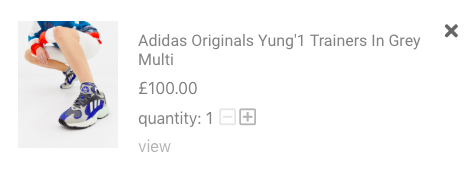

# Wardrobe-share

Traditional online stores are great for buying individual items, but there is not much to help shoppers build a cohesive wardrobe. Wardrobe Share allows shoppers to purchase sets of items which have been thoughtfully put together by others.

A potential user could be fashion vloggers who want to share their shopping hauls.
I focused on the page to create wardrobes. You can check out the prototype here: https://awesome-meninsky-a0f113.netlify.com/

## Design Choices

### Scrolling behaviour - keep selected items on display

BAD - Selected Items disappear when scrolling  

I decided to always display selected items on the right. This makes it easier for users to compare items and it also helps them keep in mind details such as quantity of items and budget. Furthermore, it's more clear that an item has been selected as you can see the list scrolls to the item and the item counter increases.

GOOD - Scrolling with selected items fixed on the side  

### Changing Quantity

GOOD - disable button to decrease quantity to zero  

The button to decrease quantity has been disabled when the quantity is 1. Users have to click the X button to delete an item. This makes it less likely for users to accidently delete items when decreasing quantity.
